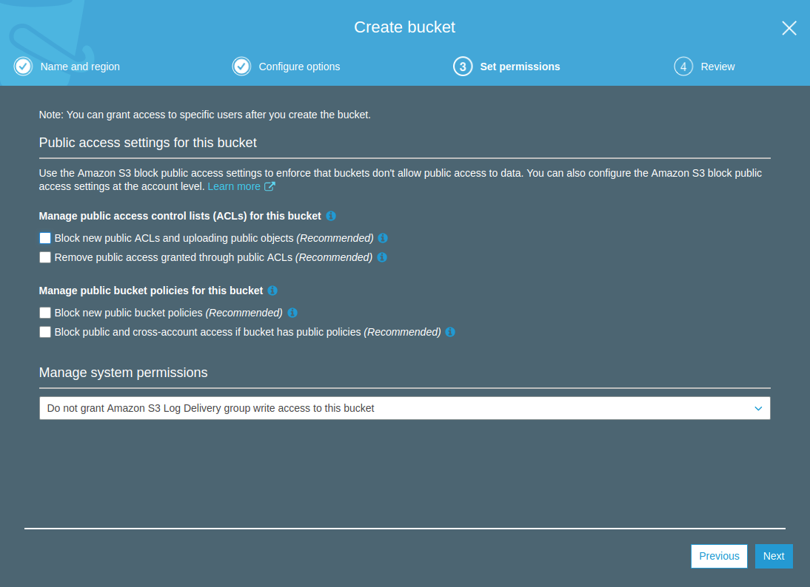
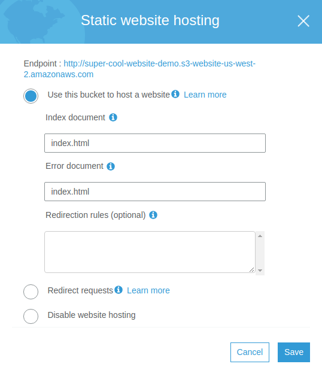
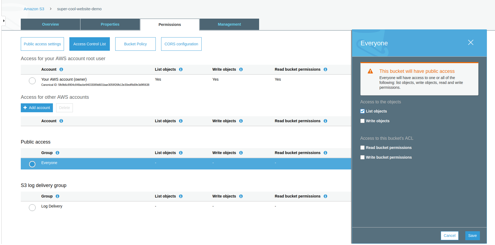
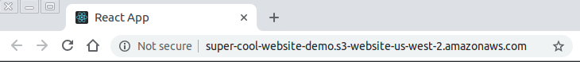

# Creating & Deploying a React App to AWS (Part 1)

If you've ever wondered how to create and deploy your own multipage React app, 
then you've come to the right place. Before we get started you will need 
the following packages installed on your computer:
- [npm](https://www.npmjs.com/get-npm)
- [awscli](https://docs.aws.amazon.com/cli/latest/userguide/install-bundle.html)

## Part 1: Creating the React App
In order to create the react application we will be using the `create-react-app`
library, which must be installed globally.
```bash
$ npm install -g create-react-app
```
With the `create-react-app` library installed, we can create our 
**super-cool-website** app.
```bash
$ create-react-app super-cool-website
```
Once the application is created, we will need to install the `react-router-dom` 
library, which will allow us to create routes within our application.
```bash
$ npm install --save react-router-dom
```
Now that our app is created and we have all the necessary libraries installed, 
lets open up the `src/index.js` file and add some routes. 
```jsx
import React from 'react';
import {hydrate} from 'react-dom';
import {BrowserRouter, Route, Switch} from 'react-router-dom';
import './index.css';
import App from './App';
import * as serviceWorker from './serviceWorker';

const app = (
    <BrowserRouter>
        <Switch>
            <Route exact path="/" component={App}/>
            <Route exact path='/other-page' component={App}/>
        </Switch>
    </BrowserRouter>
);

const rootElement = document.getElementById('root');
hydrate(app, rootElement);

// If you want your app to work offline and load faster, you can change
// unregister() to register() below. Note this comes with some pitfalls.
// Learn more about service workers: http://bit.ly/CRA-PWA
serviceWorker.unregister();
```
When you're done updating the `src/index.js` file, you can now start the app
by running the below command from the root of the project directory:
```bash
$ npm run start
```
Congratulations, you have a working multipage React application! Now 
lets create the infrastructure needed to host our app in AWS. 

## Part 2: Creating the Infrastructure

### Creating the S3 Bucket
The first step to deploying the app, is to log into the AWS console and on 
the home page under **storage**, select **S3**. Once you're on the S3 page, 
you'll need to click the **Create Bucket** button and follow the prompts:
1. **Name and Region**: add a globally unique name for your bucket, I've named 
mine **super-cool-website-demo**. 
2. **Configure Options**: check the **Keep all versions of an object in the 
same bucket** option. This option will keep multiple variants of a file in 
the same bucket, it's best practice turn this option on so files can be easily 
recovered if they're accidentally deleted.
3. **Set Permissions**: the following boxes must be unchecked 
in order to allow the public to access the files for our website.
    * Block new public ACLs and uploading public objects
    * Remove public access granted through public ACLs
    * Block new public bucket policies
    * Block public and cross-account access if bucket has public policies

    
    
    **Note**: anyone in the world can view whats in this bucket, so please 
    **don't put sensitive information in it!**

4. Review your bucket configuration and select the **Create Bucket** button.

### Configuring the S3 Bucket
In this section, we will be configuring the S3 bucket so that it can host our 
react application.
1. Select the bucket you've just created and navigate to the **Properties** tab.
2. Enable the **Static Website Hosting** feature.

    

3. Navigate to the **Permissions** tab, select **Access Control List**, 
and under **Public Access** select the radio button for **Everyone**.  In the
prompt, select the **List Objects** check box, and click save.

    

4. Under the same **Permissions** tab, select the **Bucket Policy** button, 
and add the following policy. Make sure to replace 
**super-cool-website-demo** with your own bucket name.
    ```javascript
    {
      "Version": "2012-10-17",
      "Id": "super-cool-website-demo-bucket-policy",
      "Statement": [
        {
          "Action": [
            "s3:GetObject"
          ],
          "Effect": "Allow",
          "Principal": "*",
          "Resource": "arn:aws:s3:::super-cool-website-demo/*"
        }
      ]
    }
    
    ```

## Part 3: Deploying the Application
With our S3 bucket created and configured, we can now deploy our react app! 
In order to do this we are going to add the following line to the **scripts**
section of our **package.json** file.
```javascript
"deploy": "npm run build && aws s3 sync build/ s3://super-cool-website-demo"
```
This command will build our react application and send the build files to the
S3 bucket. For this step it is very important that you have the **AWS CLI** 
installed.

With the command added to our package.json, we can now deploy the app by 
running this simple command.
```bash
$ npm run deploy
```

Congratulations, you can now access your app!




## Next Article
In the next article you will learn how to deliver your app securely and 
efficiently using CloudFront.
